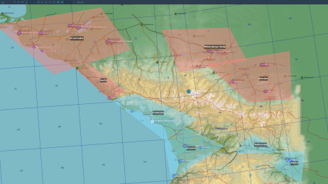
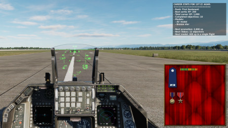

# The Universal Mission for DCS World

**Current version: open beta 0.1.250723** (see the "version history" section at the end of this file for a list of the latest changes)

**This is a BETA version, there may be bugs and there WILL be unbalanced stuff.**

The Universal Mission for DCS World is an attempt to create a fully dynamic single-player/PvE mission giving access to the whole content of DCS World in a structure similar to the one found in old "simulators", like the early Microprose games (think F-117 or the Strike Eagle serie).
These game had both fun and clear objectives, endless replayability and a career system that made sure that something was at stake: crash and die, and you'll lose all these hard-earned medals.

As the original creator of [Briefing Room](https://github.com/DCS-BR-Tools/briefing-room-for-dcs) (now maintained by the talented John Harvey), I've always wanted to create an easy-to-use, enticing and fun mission generator for DCS, capable of creating CPU-light missions without requiring an external program.
I think with The Universal Mission is, finally, the proper way to approach this problem. The current version is still an early beta but most core features are already working. I hope you'll like it.

### Features

- Can generate any kind of mission: ground attack, interception, strike, airbase attack, CAS, CAP, and more
- Completely dynamic, no two missions are ever the same
- Entirely self-contained inside a .miz file, no need for any external program
- More than 300 voiced radio messages for immersive and realistic coms
- Supports both single-player and small-scale PvE on closed servers
- Persistent single player career mode, with awards and promotions. Dying won't reset your progress, but you have to come back to base alive for your kills and completed objectives to be saved to your profile, so watch out for SAMs on your way home
- Uses advanced DCS World scripting functionalities (like the brand new Disposition singleton and net.dostring_in hacks) to achieve effects seldom seen in other scripts, such as graphic overlays and random but realistic placement of units in cities and forests without the use of handmade spawn points
- Various little details to make the DCS world more alive, like crew running away from destroyed vehicles

### Limitations of current beta version

**Please read the "planned development" section below for more information.**

- The current version supports only modern (post-Cold War) units and Caucasus, Kola, Marianas, Persian Gulf and Syria theaters
  - Germany support will come soon, others will follow later
- Not all mission types are supported yet
- Career progress may be lost because of future updates, don't get too attached to it

### Known bugs

- AWACS datalink info is now displayed on SA pages

## How to use/play The Universal Mission?

### First setup

- Download the latest release from this GitHub page.
- Copy the provided autoexec.cfg file to your **[Saved Games]\DCS\Config directory**
- Copy the .miz files for your theater(s) of choice to your **[Saved Games]\DCS\Missions directory**
- _**(Optional but strongly recommended)**_ Unsanitize the Lua IO module. You don't have to do this, but the persistent career system won't work if you don't. To do it, open the file **[DCS World installation directory]\Scripts\MissionScripting.lua** with a text editor and comment or remove the line "sanitizeModule('io')". Make sure you restart DCS World once you've modified the file.
  - Please note: should you want to backup, delete or transfer it, career progress is saved in **[DCS World installation directory]\TheUniversalMission.sav**

### Customizing the mission to your taste

- _**(Optional but you'll probably want to do it)**_ Open the .miz file in the DCS World mission editor and change the player unit to pick your desired aircraft. The default player unit is a Su-25T (as it is the only free DCS airplane equipped with weapons) and you probably won't want to stick with it.

Please refer to the "Advanced stuff you may want to try" section to learn all the ways you can customize The Universal Mission.

### Starting the mission

- Launch the mission from the mission editor or the "Mission" selection in the main DCS World menu
- You are now on the ramp or runway. Open the communication menu (see "Using the mission menu" below) and navigate to the F10/Other menu. From there, you can view and change mission settings. They include:
  - Who belong to the blue and red coalitions
  - The type of mission
  - The number and location of targets (you can use the F10 map to see where the available target zones are located).
  - The amount of enemy air force and air defense. The higher these settings, the more XP you'll recieve upon completion of a single-player mission
- When you're ready, pick the "Begin mission" option, wait a few seconds (precaching all the game assets can take some time, especially if you have a slow CPU), you're ready to go!
- Use the F10 mission and check the F10 map for additional information about the mission (see "Using the mission menu" below). Don't forget to come back to base alive, all awarded XP and completed objectives will only be saved to your pilot profile once you've landed

### Using the mission menu

Most features of The Universal Mission require the use of the "F10. Other" menu. To access it, press the "Communication menu" key (check the key bindings), navigate to the root menu by pressing F11 ("Previous menu") if need, then press "F10" to access the "Other" menu.
The exact content of the menu will depend on the current phase of the mission.

#### On startup/when no mission is active

- **Display mission settings**: Displays the current mission settings, that will be applied if you choose to start the mission now.
- **Change mission settings**: Allows you to change the mission settings to your taste.
  - **Blue coalition**: Who is the blue coalition? Determines the type of units that will be spawned. Available factions (e.g. NATO) depend on the missions's time period and theater.
  - **Red coalition**: Who is the red coalition? Determines the type of units that will be spawned. Available factions (e.g. USSR) depend on the missions's time period and theater.
  - **Mission type**: What will your mission be?
    - **Antiship strike**: Sink enemy warships and cargo ships.
    - **Ground attack**: Interdiction missions against armor, artillery and convoys.
    - **Interception**: Shoot down strategic airplanes (bombers, transports...) and enemy attack planes on interdiction missions.
    - **SEAD**: Destroy enemy SAM sites.
    - **Strike**: Destroy enemy structures and civilian buildings occupied by enemy forces.
  - **Target location**: Where on the map will the targets be spawned? Approximate distance to possible regions is displayed in the menu. You can also. Make sure to pick a region not too far away from your starting location if you don't like long ingresses. Picking a region very close to your starting location (for instance, the one where your airbase is located in) can also be a bad idea, as you might takeoff in range of an enemy SAM. Be aware that targets of antiship strikes will always be spawned in open seas, which can be quite far if you picked a landlocked target zone.
  - **Target count**: How many objectives will be spawned. More objectives means potentially more xp in a single sortie, so better medals, but also more work and more risk. Be aware that you can RTB to rearm/refuel at any time between objectives, but you won't accumulate as many single-sortie XP as if you complete objectives without going back to base, because XP is awarded to your profile and reset each time you land.
  - **Enemy air defense**: Amount, quality and skill of enemy surface-to-air units (AAA, MANPADS and SAM). A higher setting awards more XP.
  - **Enemy air force**: Amount, quality and skill of enemy combat air patrols. A higher setting awards more XP.
  - **Wingmen count**: **(COMING SOON!)** How many wingmen will fly by your side (from zero to three). A small XP penalty is added for each additional wingman. Wingman won't get replaced if they get shot during a mission, but they will (with full payload) each time you land and takeoff again. Only shown in single-player missions.
  - **Friendly AI CAP**: Should AI fighter aicraft be spawned regularly to patrol the AO and shoot down potential threats? Disabling this option will award you more XP (only if "Enemy air force" is not set to "None") but also means you and your wingmen will be alone against the whole enemy air force.
- **View pilot career stats**: Displays a list of your achievements, as well as your medal case. Only available when playing single-player missions and if the Lua IO module has been unsanitized (see "First setup" above)
- **Begin mission**: Starts a mission with the current settings.

#### During the mission

- **Mission status**: Displays a summary of the mission's status (list of objectives and progress on each objective).
- **Objectives**: Displays a list of commands related to each of the mission's objectives.
  - **Objective coordinates**: Displays the coordinates of the objective and its BRA ("fly X for Y") relative to the player's position. Some objectives types (e.g. strike missions) are provided with exact coordinates, but must will only have approximate coordiantes, so you'll have to search for your targets in the objective area.
  - **Smoke marker on target**: Asks for a friendly JTAC to pop a smoke marker on the target. Makes finding the target easier, but will cost you a small XP penalty. Only available for missions where a JTAC is available (it's pretty hard to throw a smoke grenade at an airplane or a ship in the middle of the sea).
- **Flight**: **(COMING SOON!)** Displays a list of commands for your wingmen. Only shown in single-player missions and if wingmen are available for this mission.
  - **Cover me!**: Tasks your wingmen to immediately engage any nearby air threats.
  - **Engage**: Tasks your wingmen to engage a certain type of targets. Targets must be detected by your wingmen (see "Report contacts" below), or they won't be able to engage them.
  - **Report contacts**: Asks your wingmen for a list of all detected contacts. According to range and sensors capabilities, their reports can go from perfect ID (e.g. "Su-27") to very generic descriptions (e.g. "fighter" or even "aircraft")
  - **Hold position**: Tasks your wingmen to orbit at their current position. All other tasking will be aborted.
  - **Change altitude**: Asks your wingmen to change their altitude. This altitude will be employed when attacking on orbiting but not when rejoining/forming up with you (in that case, they'll match your altitude).
  - **Status report**: Asks your wingmen for a complete report (damage sustained, fuel status, available payload).
  - **Rejoin**: Asks your wingmen to rejoin and follow you. All other tasking will be aborted. This is the default tasking when wingmen take off and when they complete another task.
- **AWACS**: Displays a list of commands for the AWACS. Only shown if an AWACS aircraft is available for this mission.
  - **Bogey dope**: Asks for the nearest enemy air threat
  - **Picture**: Asks for a summary of all detected enemy aircraft
- **Display mission score**: Displays the number of XP gained and objectives completed since your last takeoff. They will be added to your flight log (and any promotions/medals be awarded) the next time you land. If you crash, eject or abort the mission, all currently "stowed" XP and objectives will be lost. Only available when playing single-player missions and if the Lua IO module has been unsanitized (see "First setup" above)
- **Abort mission**: Aborts the current mission and forfeit all XP/objectives gained since last landing. The game will ask for confirmation so you don't select this option by mistake.

### Advanced stuff you may want to try

The Universal Mission is designed to be easily editable to suit your preferences. Here are a few things you could do after opening the .miz file in DCS World's mission editor.

#### Player aircraft

- Change the player aircraft starting condition (runway, parking or parking hot). Air starts are not recommended as all players must be on the ground to begin a new mission
- Move it to another airbase, change its coalition (make sure blue players are spawned on an airbase located in a BLUFOR zone are red players are spawned on an airbase located in a REDFOR zone)
  - You may also add an aircraft carrier or a FARP for the player to take off from
- Change its default loadout if you plan to play a specific kind of mission and don't want to lose time asking the ground crew to rearm your aircraft (e.g. if you know you want to play SEAD missions, you may as well stock up on AGM-88s)
- Change the skill level from "Player" to "Client" and add other aircraft to create a multiplayer mission to play with your friends. Keep in mind that the persistent career/player stats system will be disabled in multiplayer missions and that all player aircraft must belong to the same coalition (TUM does not support PvP)

#### Zones

- All zones whose names starts with BLUFOR or REDFOR decide the territory (and airbases) controlled by the blue and red coalitions
  - Be aware that any change to the airbases coalitions will be superseded by the BLUFOR and REFOR zones
- All zones whose names starts with WATER are seas, used to spawn ships
- Zones with a name not starting with BLUFOR, REDFOR or WATER are target zones. These are zones where objectives can be spawned, who can be selected in the "objective location" setting of the intermission F10 menu
  - Change, add or remove zones to create new possible target areas. A maximum of 10 target areas can be created, so they fit the F10 menu

#### A few notes regarding multiplayer

While The Universal Mission supports multiplayer and is perfectely suitable (and fun!) for playing with friends on a private server, it is **absolutely not suited for public servers** as missions settings can be edited by anyone at any time Using the mission menu.
Please also note that PvP is not supported at the moment and that the mission will not launch if both coalitions have player slots.

#### Other parameters

- _(Not yet implemented in this version)_ By changing the year in mission time parameters, the time period will be changed accordingly and the proper factions and AI units will be spawned during the mission. Time periods are:
  - 1945 and before: World War 2
  - 1946-1959: Korea War
  - 1960-1974: Vietnam War
  - 1975-1989: Late Cold War
  - 1990-now: Modern
- _(Not yet implemented in this version)_ Changing the weather to make it more cloudy or windy, or setting the mission to nighttime, will make the mission more difficult but also award more points.

## Planned development

### VERY high priority

- All new AI wingman system
- Fix bug with AWACS datalink info not showing on SA pages
- New objectives: helicopter (drop/pickup units...), CAP, CAS, OCA (airbase attack)
- Support for the Germany and South America theaters
- Support for more factions and five different time periods (World War 2, Korea war, Vietnam war, late Cold war, Modern)

### High priority

- Additional and better radio messages
  - More "flavor" radio messages ("fence in" when player approaches the AO, etc) so the world will feel more alive
- Better balancing of the player career awards and promotions
- Better use of context for "ambient" radio messages (should only warn of a SAM launch if an AI pilot is there to witness it, etc)
- Friendly air defenses
- Laser designation of targets by JTAC
- Support for all missing DCS World theaters

### Medium priority

- Advanced options such as "use metric units" or "use bullseye rather than player position for coordinates transmission" (the later awarding more XP when enabled, because of the need for higher situational awareness)
- GitHub page
- Improved score multiplier taking into account various aspects of mission difficulty (weather, nighttime ops...)
- Modded units support (other than player-controlled aircraft, those are already supported: just add them to the mission)
- Spawning of tankers for long-range missions
- (maybe) Text (not voiceover) localization, if there's enough popular demand

### Low priority

- Female voice option for the player
- New ATC system. Won't be realistic/BMS-like but a LOT better than the vanilla DCS one
- (maybe) AI CSAR helos to pick up stranded/ejected pilots
- (maybe) PvP support

## Misc

- **Released under the GNU GPL 3.0 licence**
- AI use/disclosure
  - [ChatGPT](https://chatgpt.com/): used to generate first draft of radio messages
  - [ElevenLabs](https://elevenlabs.io/fr): used to generate radio messages voiceover

## How to build the miz files

_**(this is for developpers only, end users should just download the latest release)**_

I use a PHP script to "build" the .miz files as PHP is a pretty handy tool capable both of handling all required replacements and pack the miz files.

If you want to build the .miz files yourself, you'll need to:

- [Download PHP](https://www.php.net/) and install it
- Add the PHP directory it to your system PATH so the batch file will find it
- In the PHP directory, rename php.ini-production to php.ini, edit it and uncomment or delete the "extension=mbstring" line to enable the MBString extension that my script uses.
- Then run Make.bat in the source directory (or, alternatively, open the source directory in VSCode and press Ctrl+Alt+B)
- .Miz files will be generated in the project root directory, and a copy will be sent to your DCS World "missions" directory (if it exists)
- Please note that a second version of each file marked "DEBUG" will also be generated. This version allows access to the debug menu and additional text outputs during the mission. Debug missions are generated with an F-16C player aircraft as it's a good jack-of-all-trades to test various things.

## Want to contribute to the project?

The core script is quite simple and small, I probably won't need too much help with it (of course you're free to suggest improvements and submit pull requests).

**What I'll need help with most is:**

- Feedback, feedback, feedback. Especially regarding bug (don't forget to write down the various script line numbers mentioned in the error message!) mission balancing and career progression.
  - You can contact me through GitHub or send me a mail at akaagarmail@gmail.com
- You can also [buy me a coffee](https://buymeacoffee.com/akaagar)!

## Version history

- **Next version** (coming soon)

  - **MAJOR CHANGE:** Added all new wingman system
    - Far for perfect but a lot smarter than AI's default wingmen
    - Many more engage/orbit/go to commands (see "Using the mission menu" above)
    - All new contacts report system: more realistic (see "AI units reports" changes below in this changelog) and does not spam the player with "new contact" messages
    - AI wingmen added using mission editor are now despawned on mission start to avoid conflict with TUM's own wingman system
  - Added 138 new radio messages, with voiceover
    - 120+ wingmen commands and replies
    - Additional voiceovers for Fox 1/2/3 calls
    - "Infantry kill" BDA report
  - Added error message on mission start when autoexec.cfg is missing and script cannot proceed
  - Added payload table for all DCS World aircraft (datamined from Briefing Room, many thanks to @john681611)
  - Added "Using the mission menu" section to this README file, detailing all available commands
  - Added "weapons introduction date" table for upcoming "time period" setting (datamined from Briefing Room, many thanks to @john681611)
  - All AI aircraft now despawned on landing to free CPU cycles and allow space for new aircraft
  - Changed AWACS aircraft detection logic (a tiny bit less realistic but more efficient)
  - Changed some UTF-8 symbols in F10 menu, added UTF-8 symbol for "Objectives" submenu
  - Fixed missing airbase name in "aircraft landed safely" messages
  - Improved display of XP modifiers in menu
  - Improved wording of many lines and commands, correct a bunch of typos
  - Increased minimum aircraft spawn altitude to avoir crashes in nearby hills
  - Infantry escaping from destroyed vehicles is now hidden on F10 map, as it should be
  - Interception objectives are now marked as complete when target is shot down
  - Lowered MANPADS count and skill (MANPADS are overpowered in DCS, especially SA-18)
  - "New friendly/enemy aircraft taking off" radio messages now mention their BRAA relative to the player, number of bandits taking off now displayed as a word instead of digits
  - "Rifle!" and "Missile away!" radio calls now both used for any kind of A/G missiles
  - Tons of internal logic bugfixes and tweaks
  - Tweaked XP bonus/penalty for various mission settings
  - Vastly improved the way AI units reports on contact tracks. According to range and sensors capabilities, can go from perfect ID (e.g. "Su-27") to very generic descriptions (e.g. "fighter" or even "aircraft")

- **0.1.250723** (07/23/2025)
  - Added new "autoexec.cfg" file required by DCS 2.9.18.12722. You have to copy it to **[Saved Games]\DCS\Config directory** or the script won't work.
  - Fixed a bug with convoys sometimes stuck in trees and buildings
  - Fixed a bug with "intermission" menu not showing properly on mission completion
  - Fixed a bug with non carrier-capable aircraft spawning on carriers
  - Fixed a bug with "rockets!" radio call causing an error message
  - Improved wording on the "XP awarded" and "all XP will be lost" messages
- **0.1.250722-update1** (07/22/2025)
  - Added Kola theater
  - Added Marianas theater
  - Added message when XP is awarded to player after landing
  - Fixed bug when friendly non-unit object is hit
  - Slightly lowered XP required for medals and promotions
- **0.1.250722** (07/22/2025)
  - Initial public release
